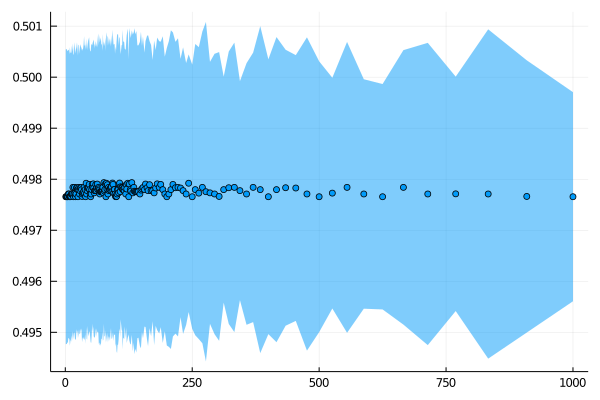
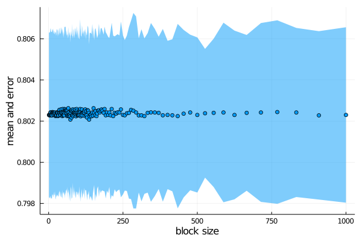
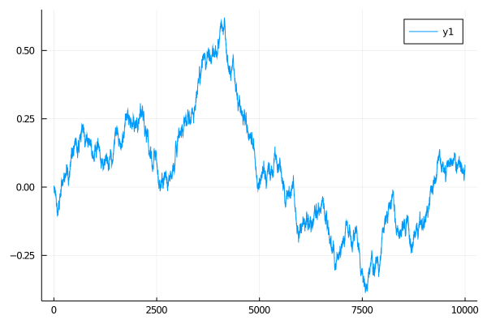
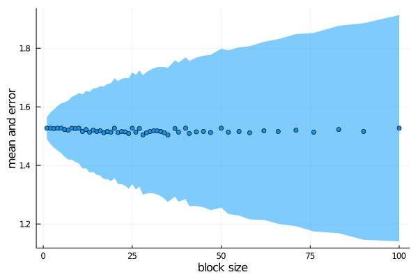
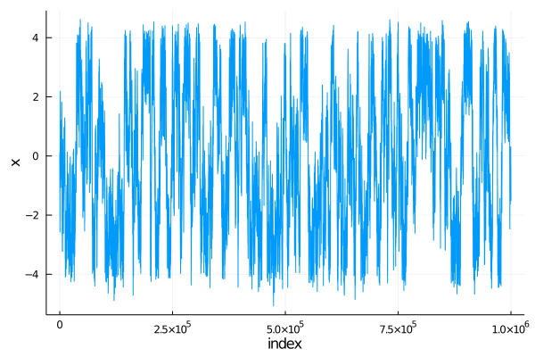
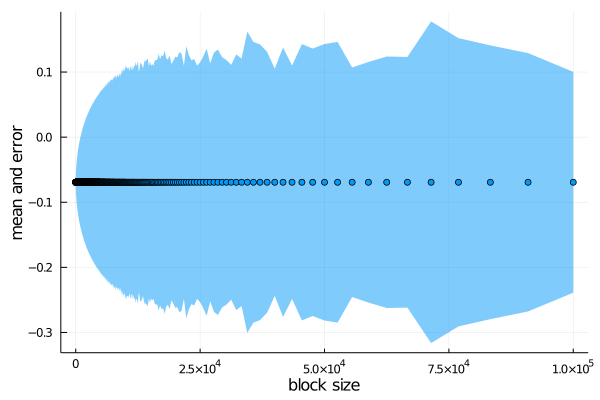

# BlockAverage

Computes the block average of time-dependent data, to compute the standard error of the mean and, to detect sampling problems. A didactical explanation of block averaging is available [here](http://sachinashanbhag.blogspot.com/2013/08/block-averaging-estimating-uncertainty.html).  

## Instalation

Install with
```julia
julia> ] add https://github.com/m3g/BlockAverage.jl

```

A help entry is available with:
```julia
julia> ? block_average

```

## Examples:

### Data that is not time-correlated:

#### Compute the average of a random variable `x`:

```julia
julia> using BlockAverage

julia> x = rand(10_000);

julia> avg, err, sizes = block_average(x)

julia> using Plots

julia> scatter(sizes,avg,ribbon=err,label="",ylabel="Mean and error",xlabel="Block size")

```

Results in:



Note that the average (scatter points) and the error of the estimate of the mean are roughly constant with block size, indicating that the data is not correlated "in time". 

#### Compute the average number of points in `x` such that `x > 0.2`:

```julia
julia> avg, err, sizes = block_average(x,by=v->count(v .> 0.2)/length(v))

```

Note that here we pass an anonymous function `v -> count(v .> 0.2)/length(v)` which will compute the mean number of elements of `v` that are greater than `0.2`. This function will be used to compute, for every block size, the value of the function at that block.  

The corresponding plot is:




### Data that is time-correlated

#### Poorly-sampled data

The data above is not correlated in the input `x` vector. If the data is correlated, one can observe that in the dependence of the estimates of the average and error from the data. One can generate a test data (sort of a monte-carlo simulation of a particle in an harmonic well) using:

```
julia> x = BlockAverage.test_data(1_000);

```
Which in this run produced:



The error of the estimate of the mean is, now, dependent on the block size, and we cannot see any convergence of the error, indicating that the sampling is not enough to obtain a reliable estimate of the mean value of `x`:  

```julia
julia> avg, err, sizes = block_average(x);

julia> scatter(sizes,avg,ribbon=err,label="",ylabel="mean and error",xlabel="block size")

```



#### Properly sampled data

If we increase the sampling by generating longer simulation:
```
julia> x = BlockAverage.test_data(1_000_000);

```

The obtained set is now much better sampled,




and it is possible to observe the convergence of the estimate of the error of the mean for block sizes that are large enough: 



Note that the average value of `x` here is `-0.0693` and the estimate of the error of this average is of `±0.17`, consistently with the fact that this "simulation" should be centered at `x=0`.

The time required to essentially decorrelated the data appears to be of the order of `10_000` steps, as indicated by the convergence of the estimate of the error of the mean. 


