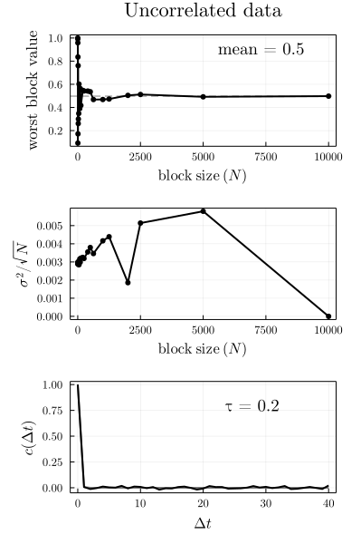

# BlockAverage

Computes the block average of time-dependent data, to compute the standard error of the mean and, to detect sampling problems.  

## Instalation

Install with
```julia
julia> ] add https://github.com/m3g/BlockAverage.jl

```

## Examples:

### Data that is not time-correlated:

1. Compute the average of a random variable `x`:

```julia
julia> using BlockAverage

julia> x = rand(10_000);

julia> avg, err, sizes = block_average(x)

julia> using Plots

julia> scatter(sizes,avg,ribbon=err,label="",ylabel="Mean and error",xlabel="Block size")

```

Results in:



Note that the average (scatter points) and the error of the estimate of the mean are roughly constant with block size, indicating that the data is not correlated "in time". 


