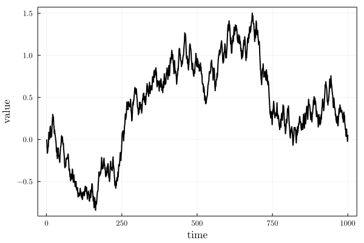
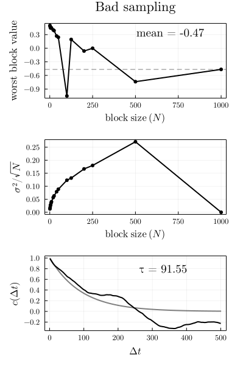
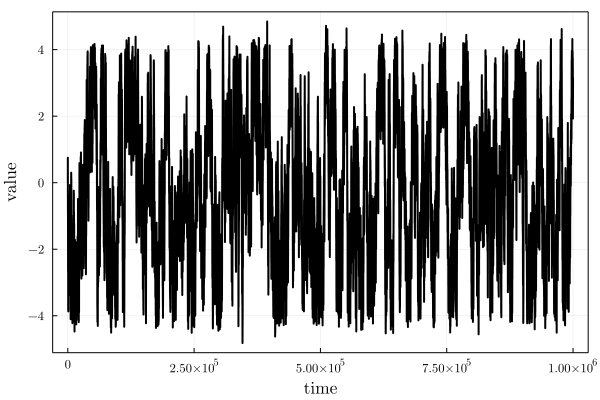
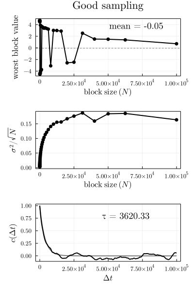

# BlockAverage

Performs an analysis of the convergence of some property (usually the mean) in a time-series. 

Computes the block average of time-dependent data, to compute the standard error of the mean and, to detect sampling problems. A didactical explanation of block averaging is available [here](http://sachinashanbhag.blogspot.com/2013/08/block-averaging-estimating-uncertainty.html).  

The package also outputs the autocorrelation function of the property, and the characteristic time of the correlation
decay. 

## Instalation

Install with
```julia
julia> ] add https://github.com/m3g/BlockAverage.jl

```

Help entries are available with:
```julia
julia> ? block_average

julia> ? BlockAverageData
```

## Examples:

### Data that is not time-correlated:

#### Compute the average of a random variable `x`:

```julia
julia> using BlockAverage

julia> x = rand(10_000);

julia> b = block_average(x)
-------------------------------------------------------------------
BlockAverageData{Float64}
-------------------------------------------------------------------
Estimated value (mean by default) = 0.4977014924716461
Length of data series: 10000

Block size ranges: (1, 10000)

Maximum standard error (error, block size): (0.005790454921861948, 5000)

Deviations in last 3 blocks:
         percentual: [2.8893559885598195, -1.1634393325014705, 0.0]  
           absolute: [0.014380367877881106, -0.005790454921861976, 0.0]  

Autocorrelation is first zero with lag: 2
Characteristic time of autocorrelation decay: 
        as fraction of series length: 2.0182708552030272e-5
                            absolute: 0.2018270855203027
-------------------------------------------------------------------

julia> using Plots

julia> BlockAverage.plot(b, title="Uncorrelated data")

```

Results in:


Thus, the worst block estimate converges very rapidly to the true mean, the standard error of the mean is very small, and the autocorrelation decays very quickly. Since the data is not correlated along the series, the characteristic time may not be meaningful. 

### Data that is time-correlated

#### Poorly-sampled data

The data above is not correlated in the input `x` vector. If the data is correlated, one can observe that in the dependence of the estimates of the average and error from the data. One can generate a test data (sort of a monte-carlo simulation of a particle in an harmonic well) using:

```
julia> x = BlockAverage.test_data(1_000);

```
Which in this run produced:



The error of the estimate of the mean is, now, dependent on the block size, and we cannot see any convergence of the error, indicating that the sampling is not enough to obtain a reliable estimate of the mean value of `x`:  

```julia
julia> b = block_average(x, lags=1:500)
-------------------------------------------------------------------
BlockAverageData{Float64}
-------------------------------------------------------------------
Estimated value (mean by default) = -0.5616539552467762
Length of data series: 1000

Block size ranges: (1, 1000)

Maximum standard error (error, block size): (0.24081057091463817, 500)

Deviations in last 3 blocks:
         percentual: [80.94415878065803, 42.87525595877488, -0.0]  
           absolute: [-0.4546260693327965, -0.2408105709146382, 0.0]  

Autocorrelation is first zero with lag: 194
Characteristic time of autocorrelation decay: 
        as fraction of series length: 0.06981859583876429
                            absolute: 69.8185958387643
-------------------------------------------------------------------
```

Note that we have adjusted the range of `lags` of the autocorrelation function in this case.

Several characteristics of the output indicate the poor convergence of the series: 1) The mean should be `0.` for this property; 2) the maximum standard error occurs with a block size which is half the length of the series (there is no plateau); 3) the standard error of the mean is of the order of the mean value; 4) The autocorrelation is first zero at ~20% of the length of the data set. 

The corresponding plot is obtained with:
```julia
julia> using Plots

julia> BlockAverage.plot(b, title="Bad sampling")
```



#### Properly sampled data

If we increase the sampling by generating longer simulation:
```
julia> x = BlockAverage.test_data(10^6);
```

The obtained set is now much better sampled,



The convergence analysis of the series produces:
```julia
julia> b = block_average(x, lags=1:100:10^5)
-------------------------------------------------------------------
BlockAverageData{Float64}
-------------------------------------------------------------------
Estimated value (mean by default) = -0.27183400739040475
Length of data series: 1000000

Block size ranges: (1, 1000000)

Maximum standard error (error, block size): (0.20031693993066216, 100000)

Deviations in last 3 blocks:
         percentual: [42.60276435944698, 0.08192330915966697, -0.0]  
           absolute: [-0.11580880161737583, -0.00022269541427555328, 0.0]  

Autocorrelation is first zero with lag: 9401
Characteristic time of autocorrelation decay: 
        as fraction of series length: 0.0032460464542995214
                            absolute: 3246.0464542995214
-------------------------------------------------------------------
```

Note that the average value of `x` here is closer to zero, and that the maximum standard error of the mean is consistent the true value being around zero. The correlation decays fast relative to the length of the data series.

The corresponding plots are:

```julia
julia> using Plots

julia> BlockAverage.plot(b, title="Good sampling")
```



The plateau of standard errors (second plot) in intermediate values of block sizes is typical of a properly sampled data set, and can be used as an the uncertainty in the property estimate. 

For example, for an ever better sampled data, there is a very clear plateau of standard errors, which are smaller than those of the above example:

```julia
julia> x = BlockAverage.test_data(10^7)

julia> b = block_average(x, max_block_size=10^5, lags=1:100:10^5);

julia> BlockAverage.plot(b)
```


(here we have computed the statistics only up to blocks of size `10^5`)


